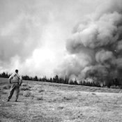

An Unusual Career Path
----------------------

I grew up in upstate New York. I was in college studying painting at `Syracuse University <https://www.syracuse.edu/>`_ when I traveled west for a summer of `commercial fishing in Alaska <http://www.adfg.alaska.gov/index.cfm?adfg=commercialbyfisherysalmon.main>`_. This experience left me with a taste for adventure. After college I traveled west again and spent five years `fighting forest fires for the U.S. Federal Government <https://en.wikipedia.org/wiki/Wildfire>`_. During those five years I spent my winters with my wife in New Orleans and later upstate New York until I followed her permanently to Cambridge, Massachusetts. There I spent several years working for Harvard University, both administratively and as a teaching assistant in statistics. I eventually enrolled in graduate school at `UMass Amherst <https://www.umass.edu/>`_, where I earned dual `MBA <https://www.isenberg.umass.edu/>`_ and `Public Policy <https://www.umass.edu/spp/>`_ master's degrees. This led to my work in operations and systems at `Jumpstart <https://www.jstart.org/>`_, a national non-profit based in Boston, my work in finance at `Ford Motor Company <http://www.ford.com>`_, and my several years at `EMC Corporation <https://www.emc.com/en-us/services/professional-services/index.htm>`_, a global technology firm now owned by `Dell Technologies <https://www.delltechnologies.com/en-us/index.htm>`_, where I supported strategic programs and eventually managed the company’s consulting business with two financial industry global customers in New York City.

.. image:: _static/thumb-creative.jpg
    :width: 24%

.. image:: _static/thumb-pursesein.jpg
    :width: 24%

